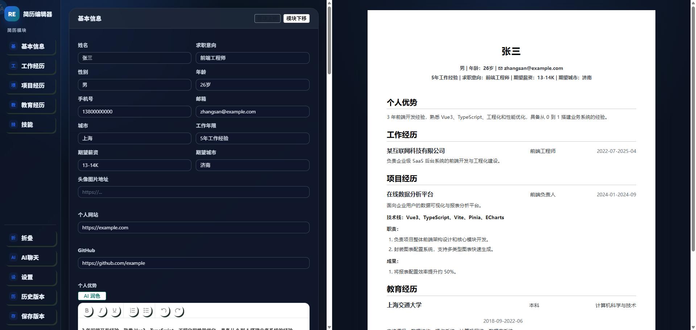
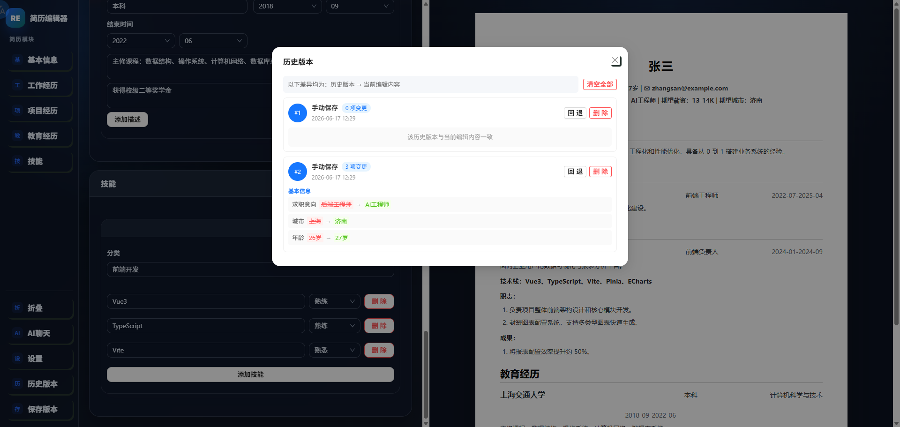
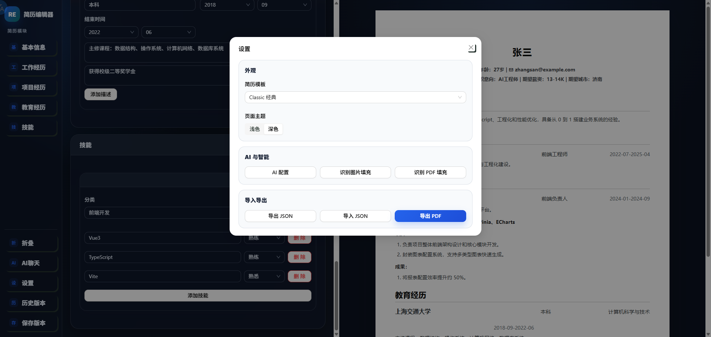

# Open-Resume

在线简历编辑工具，支持结构化简历编辑、多模板实时预览、AI 润色、PDF/图片识别、AI 聊天修改、版本历史、JSON 导入导出、PDF 导出和自定义模板。



## 功能亮点

- **结构化编辑**：基本信息、教育经历、工作经历、项目经历、技能模块。
- **实时预览**：Classic、Modern、Minimal 三套内置模板，支持自定义模板导入。
- **AI 能力**：富文本润色、PDF 简历识别、图片简历识别、AI 聊天修改。
- **版本历史**：最多保留 20 条历史记录，支持差异展示、回退、单条删除、清空全部。
- **导出能力**：支持 JSON 导入导出和服务端 A4 PDF 导出。
- **本地存储**：简历内容、历史记录、主题、AI 配置、自定义模板均保存在浏览器 localStorage。
- **主题切换**：支持浅色/深色模式。
- **自定义模板**：通过 JSON 导入自定义模板，支持自定义 CSS 样式和布局参数；提供 AI 生成提示词辅助生成模板 JSON。

## 预览

### 历史版本



### 设置弹窗



## 技术栈

| 模块 | 技术 |
|---|---|
| 前端 | Vue 3、TypeScript、Vite |
| UI | Ant Design Vue |
| 状态管理 | Pinia |
| 富文本 | wangEditor |
| 后端 | Python、FastAPI、Uvicorn |
| PDF 生成 | Playwright Chromium |
| PDF 文本提取 | PyMuPDF |
| AI | OpenAI-compatible API |

## 快速开始

### 1. 启动后端

```bash
cd api
python -m venv venv
```

Windows PowerShell：

```powershell
.\venv\Scripts\Activate.ps1
```

安装依赖并启动：

```bash
pip install -r requirements.txt
playwright install chromium
python main.py
```

后端默认地址：`http://localhost:8000`

### 2. 启动前端

```bash
cd client
npm install
npm run dev
```

前端默认地址：`http://localhost:5173`

如果本机同时运行多个 Vite 服务，建议访问：`http://127.0.0.1:5173`

## Docker 运行

项目根目录包含 `Dockerfile` 和 `.dockerignore`，支持多阶段构建。

```bash
docker build -t resume-editor .
docker run -p 8000:8000 resume-editor
```

访问：`http://localhost:8000`

> 首次构建需要下载 Playwright Chromium 和系统依赖，耗时较长。

## 功能说明

### 简历编辑器

- **基本信息**：姓名、求职意向、性别、年龄、手机号、邮箱、城市、工作年限、期望薪资、期望城市、头像、个人网站、GitHub、个人优势。
- **教育经历**：学校、专业、学历、起止时间、描述列表，支持新增、删除、排序。
- **工作经历**：公司、职位、城市、起止时间、至今、概述，支持新增、删除、排序。
- **项目经历**：项目名称、角色、起止时间、链接、描述、技术栈、职责、成果，支持新增、删除、排序。
- **技能**：分类管理技能项，支持熟练度（不显示 / 了解 / 熟悉 / 熟练 / 精通）。
- **模块排序**：设置弹窗中调整模块顺序，编辑器和预览区同步变化。

### 模板

内置三套模板，设置弹窗中切换后预览区即时更新：

| 模板 | 布局风格 |
|---|---|
| Classic | 传统中文简历布局，顶部联系方式 + 头像，正文分模块排列 |
| Modern | 双栏布局，侧栏为联系方式与技能，主栏为工作与项目经历，模块标题使用英文 |
| Minimal | 紧凑极简风格，精简头部信息，正文分栏排列 |

支持**自定义模板**：设置弹窗 → 自定义模板 → 导入模板 JSON。自定义模板可覆盖 CSS 样式、布局参数、章节标签等。提供 AI 生成提示词辅助快速创建模板。

### AI 功能

使用前需要在 `设置 -> AI 配置` 中填写接口地址、API Key 和模型。

| 功能 | 说明 |
|---|---|
| AI 润色 | 对富文本字段进行专业化改写 |
| AI 聊天修改 | 通过自然语言修改简历，支持 @ 引用工作/项目条目 |
| PDF 识别 | 上传 PDF 简历并自动填充编辑器 |
| 图片识别 | 上传简历截图并自动填充编辑器 |

### 历史版本

历史版本保存在浏览器 localStorage，最多 20 条。

| 操作 | 说明 |
|---|---|
| 保存版本 | 点击左侧“保存版本”创建快照 |
| 差异展示 | 每条历史记录展示“历史版本 -> 当前编辑内容”的字段差异 |
| 回退 | 恢复为指定历史版本 |
| 删除单条 | 删除指定历史记录 |
| 清空全部 | 删除全部历史记录 |

## 项目结构

```text
resume-editor/
├── api/                     # FastAPI 后端
│   ├── main.py              # 后端入口
│   ├── requirements.txt     # Python 依赖
│   ├── routes/              # API 路由
│   ├── schemas/             # Pydantic 模型
│   └── services/            # AI、OCR、PDF、模板服务
├── client/                  # Vue 前端
│   ├── package.json
│   ├── vite.config.ts
│   └── src/
│       ├── api/             # 前端 API 请求
│       ├── components/      # 组件
│       │   └── templates/   # 模板渲染组件
│       ├── stores/          # Pinia store
│       ├── types/           # TypeScript 类型
│       ├── utils/           # 工具函数
│       └── views/           # 页面视图
├── docs/                    # 项目文档
├── images/                  # README 截图
├── Dockerfile
└── README.md
```

## 后端接口

| 方法 | 路径 | 说明 |
|---|---|---|
| GET | `/api/health` | 健康检查 |
| GET | `/api/debug/routes` | 查看已注册路由 |
| POST | `/api/pdf/export` | 导出 PDF |
| POST | `/api/ai/models` | 获取模型列表 |
| POST | `/api/ai/polish` | AI 润色文本 |
| POST | `/api/ai/chat-edit` | AI 聊天修改简历 |
| POST | `/api/ai/recognize-pdf` | 识别 PDF 简历 |
| POST | `/api/ai/recognize-image` | 识别图片简历 |

前端 Vite 会将 `/api` 代理到 `http://localhost:8000`。

## 本地存储

| Key | 内容 |
|---|---|---|
| `resume_editor_current_resume` | 当前简历数据 |
| `resume_editor_version_history` | 历史版本，最多 20 条 |
| `resume_editor_ai_settings` | AI 配置 |
| `resume_editor_theme` | 主题配置 |
| `resume_custom_templates` | 自定义模板列表 |

## 开发命令

前端类型检查：

```bash
cd client
npx vue-tsc --noEmit
```

前端构建：

```bash
cd client
npm run build
```

前端测试：

```bash
cd client
npm test
```

后端启动：

```bash
cd api
python main.py
```

## 相关文档

- [功能说明](docs/features.md)
- [测试指南](docs/test-plan.md)
- [测试报告](docs/test-report.md)

## 常见问题

### 前端修改后页面没有变化

确认浏览器访问的是当前项目的前端服务。如果本机同时启动多个 Vite 服务，`localhost` 可能访问到其他项目，建议使用 `http://127.0.0.1:5173`。

### PDF 导出失败

确认后端已安装 Chromium：

```bash
playwright install chromium
```

并确认后端服务正常：`http://localhost:8000/api/health`

### AI 功能失败

检查 API Key、接口地址和模型是否正确。图片识别需要模型支持视觉能力。
